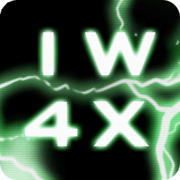

<div align="center">

# IW4x Launcher

#### Official launcher for the IW4x mod
</div>

> [!IMPORTANT]
> **Only legitimate copies of the games are supported. If you don't own the game, please buy it.**

## 🗺️ Table of Contents

<a href="https://iw4x.dev"></a>

- [Installation](#-installation)
- [Command line arguments](#%EF%B8%8F-command-line-arguments)
- [Config file](#-config-file-iw4x-launcherjson)
- [Building from Source](#-building-from-source)
- [Support](#-support)

---

## 📦 Installation
[**Windows**](#-windows) | [**Linux**](#-linux)

---

### 🪟 Windows
1. Download the game from [Steam](https://store.steampowered.com/).
2. Download the appropriate version of the IW4x launcher:
   - **Windows 64-bit**: Download the [latest iw4x-launcher.exe](https://github.com/iw4x/launcher/releases/latest/download/iw4x-launcher.exe).
   - **Windows 32-bit**: Download the [latest iw4x-launcher-x86.exe](https://github.com/iw4x/launcher/releases/latest/download/iw4x-launcher-x86.exe).
3. Place the `iw4x-launcher.exe` in the game directory.
4. Run `iw4x-launcher.exe`. After updating, the game will launch automatically.

> [!IMPORTANT]
> ### Information for server owners:
> On Windows, the launcher self-updates and restarts by spawning a new console.
> For automated processes, use `--skip-launcher-update` and manually download the latest launcher from [here](https://github.com/iw4x/launcher/releases/latest/download/iw4x-launcher.exe).

---

### 🐧 Linux

1. Download the game from Steam using either [SteamCMD](https://developer.valvesoftware.com/wiki/SteamCMD) or the official Steam desktop app.
2. Download the [latest release](https://github.com/iw4x/launcher/releases/latest) corresponding to your system architecture.
    - Most likely you want [iw4x-launcher-x86_64-unknown-linux-gnu.tar.gz](https://github.com/iw4x/launcher/releases/latest/download/iw4x-launcher-x86_64-unknown-linux-gnu.tar.gz)
3. Unpack the archive and copy the `iw4x-launcher` executable to your game directory.
    - Alternatively, you can place it in your `PATH` so you can run it from anywhere. For example, in `/usr/local/bin/`
4. Make the launcher executable: `chmod +x iw4x-launcher`
5. Run the launcher from your game directory to download the client files: `./iw4x-launcher`

> [!TIP]
> Use the `--update` command-line argument if you want to launch the game through Proton or other Wine versions instead of the default wine found in your path.

## 🎮 Supported Games

> [!IMPORTANT]
> **Only legitimate steam copies of the games are supported. If you don't own the game, please buy it.**

> **IW4x**  
> Call of Duty: Modern Warfare 2 - Multiplayer

---

## ⚙️ Command line arguments

- ```--help```
  - Print help
- ```--update```, ```-u```
  - Update the game without launching it
- ```--skip-launcher-update```
  - Skip updating the launcher
- ```--bonus```
  - Download bonus content (default)
- ```--skip-bonus```
  - Don't download bonus content
- ```--force```, ```-f```
  - Force file hash recheck
- ```--path```, ```-p```
  - Set the game installation path
    - Do not include a trailing backslash in the path
- ```--pass```
  - Pass additional arguments to the game
    - See [client-args.md](client-args.md) for more details
- ```--version```, ```-v```
  - Print the launcher version
- ```--ignore-required-files```
  - Install client even if required files are missing
- ```--skip-redist```
  - Skip installing redistributables
- ```--redist```
  - Install or reinstall redistributables
- ```--prerelease```
  - Update to prerelease version of clients (currently only available for IW4x) and launcher
- ```--rate```
  - Rate and display CDN servers
- ```--cdn-url```
- ```--offline```
- ```--skip-connectivity-check```


##### Example:
```shell
iw4x-launcher.exe --bonus -u --path "C:\Games\IW4x" --pass "-console"
```
> [!TIP]
> Some arguments can be set in iw4x-launcher.json, args generally override the values of the config.

---

## 🔧 Config file `iw4x-launcher.json`

- `update_only`: Set to true to only update the game. Default: `false`.
- `skip_self_update`: Skip launcher updates. Default: `false`.
- `download_bonus_content`: Automatically download bonus content. Default: `false`.
- `ask_download_bonus_content`: Ask before downloading bonus content. Default: `false`.
- `force_update`: Force file recheck. Default: `false`.
- `args`: Pass additional arguments to the game. Default: `""`.
- `use_https`: Use HTTPS for downloads. Default: `true`.
- `skip_redist`: Skip redistributable installations. Default: `false`.
- `prerelease`: Update to prerelease version of clients and launcher. Default: `false`.
- `cdn_url`
- `offline`
- `skip-connectivity-check`

---

## 🔨 Building from Source

See [CONTRIBUTING.md](CONTRIBUTING.md) for details.

---

## ❓ Support

Need help or have questions? We're here to help you!

- **Website & Guides**: Visit [IW4x.dev](https://iw4x.dev), especially [the guides section](https://iw4x.dev/guides)!
- **Discord Community**: Join our [Discord server](https://discord.com/invite/pV2qJscTXf) for real-time chat, quick questions, and to connect with other players.
